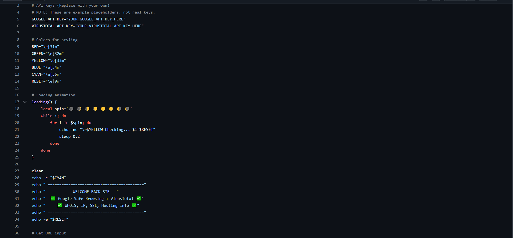
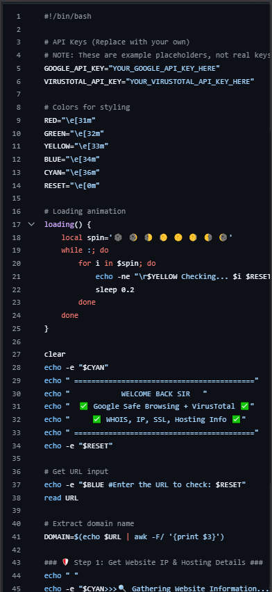

# 🔗 links_scanne

**Quick URL / Link Scanner (Bash)**

A lightweight and powerful Bash utility for analyzing URLs and domains. It performs local security checks such as DNS resolution, SSL certificate inspection, WHOIS lookups, and HTTP status verification, while also supporting optional online reputation checks through Google Safe Browsing and VirusTotal APIs.

---

## 📸 Screenshots

### 🖥️ Desktop Version



---

### 📱 Mobile Version

<div align="center">
    
</div>

---

## 🔒 Safe to Publish

✅ The script is safe to upload publicly.

It only contains **placeholder variables** for API keys and does **not** include any sensitive information or credentials.

**Important:** Never commit real API keys to GitHub.

---

## ⚙️ What This Script Does

### Local Analysis

- Resolves domains and retrieves IP addresses (`dig` or `host`)
- Extracts SSL certificate information (`openssl`)
- Performs WHOIS lookups
- Retrieves:
  - Registrar
  - Country
  - Creation date
  - Expiration date
- Checks website availability and HTTP status codes (`curl`)

### Online Reputation Checks (Optional)

- **Google Safe Browsing v4**
  - Detects phishing sites
  - Detects malware-hosting domains

- **VirusTotal v3**
  - URL reputation analysis
  - Multi-engine threat detection results

---

## 📦 Requirements

### Operating System

- Linux
- macOS

### Required Tools

```bash
curl
jq
whois
dig    # or host
openssl
grep
sed
awk
```

### API Keys

To enable online reputation checks, obtain:

- `GOOGLE_API_KEY` — Google Safe Browsing API
- `VIRUSTOTAL_API_KEY` — VirusTotal API

---

## 🧩 Install Dependencies

### Debian / Ubuntu

```bash
sudo apt update
sudo apt install -y curl jq dnsutils whois openssl
```

### Arch Linux

```bash
sudo pacman -S curl jq bind whois openssl
```

### macOS (Homebrew)

```bash
brew install curl jq whois openssl
```

---

## 🚀 Usage

```bash
chmod +x links_scanne.sh
./links_scanne.sh
```

Enter a URL or domain when prompted.

Example:

```text
https://example.com
```

---

## ✨ Features

- 🌐 DNS Resolution
- 🔒 SSL Certificate Inspection
- 📜 WHOIS Information
- 🚦 HTTP Status Checking
- 🛡️ Google Safe Browsing Integration
- 🔍 VirusTotal Integration
- ⚡ Fast and Lightweight
- 📦 Pure Bash Implementation

---

## 🛠️ Built With

- Bash
- curl
- jq
- openssl
- dig / host
- whois
- Google Safe Browsing API
- VirusTotal API

---

## 📄 License

This project is released under the MIT License.

---

<div align="center">

Made with ❤️ by linuxcoding-ADAM

</div>
